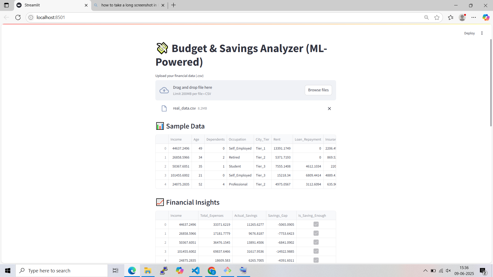
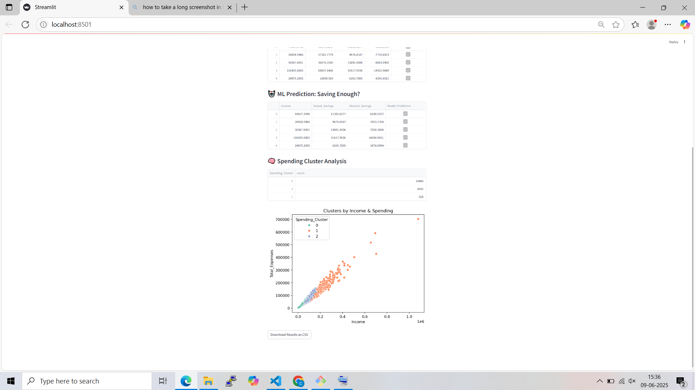

# 💰 Budget Expense Analyzer

## 📌 Overview
An ML-powered budgeting and savings analyzer that helps users manage expenses, track spending patterns, and optimize savings intelligently. Built using Streamlit, the app provides a user-friendly interface and smart insights powered by machine learning.

## 🚀 Features
- 📊 Analyze real and synthetic expense data
- 🔍 Categorize spending and identify patterns
- 📈 Predict monthly savings using ML models
- 🎯 Suggest personalized budgeting goals
- 🌐 Easy-to-use Streamlit web app interface

## 🧠 Machine Learning Stack
- Scikit-learn (Random Forest, Linear Regression)
- Pandas, NumPy for data wrangling
- Streamlit for web UI
- Matplotlib/Seaborn for visualizations

## 📂 Project Structure

## 📷 Output Screenshots

Here are some screenshots of the Budget Expense Analyzer app in action:

## 📷 Output Screenshots

### 🖥️ Sample Data


### 📈 Prediction Output



## 🔧 How to Run the App

1. **Clone this repository:**
   ```bash
   git clone https://github.com/akshat-chore/Budget-Analyzer.git

   
Navigate to the project folder:
cd Budget-Analyzer


Install dependencies:
pip install -r requirements.txt


Run the Streamlit app:
streamlit run app/streamlit_app.py


